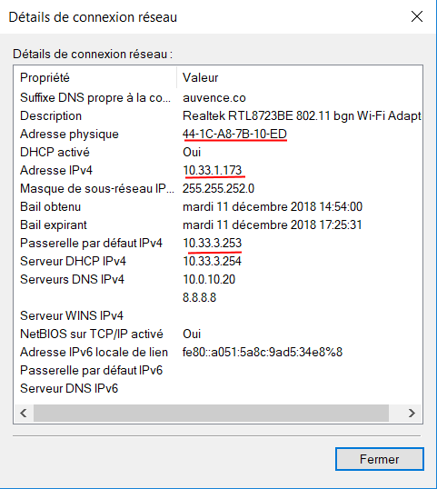
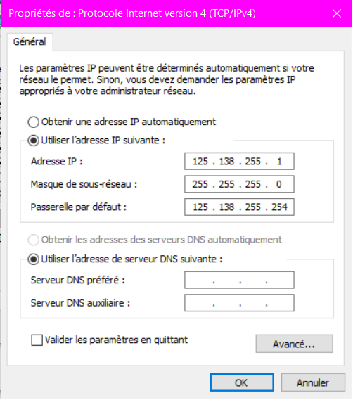
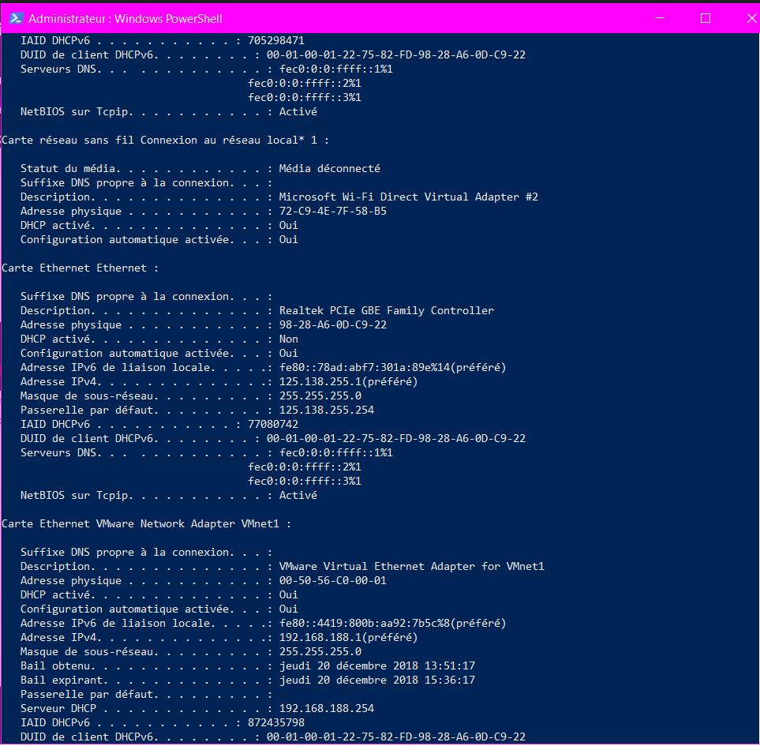
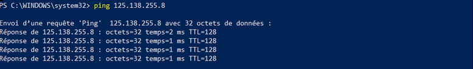
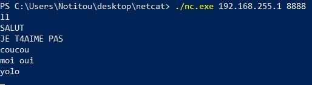

Nom, adresse MAC et adresse IP interface WIFI et Ethernet
====================

Pour afficher ces informations, il faut taper dans la ligne de commandes "ipconfig /all", cela affichera plusieurs informations dont les informations relatives à l'interface WIFI et Ethernet : 


**Carte réseau sans fil Wi-Fi** :

   Suffixe DNS propre à la connexion : auvence.co

   Description : Realtek RTL8723BE 802.11 bgn Wi-Fi Adapter

   **Adresse physique : 44-1C-A8-7B-10-ED**

   DHCP activé : Oui

   Configuration automatique activée : Oui

   Adresse IPv6 de liaison locale : 
   fe80::a051:5a8c:9ad5:34e8%8 (préféré)

   **Adresse IPv4 : 10.33.1.173(préféré)**

   Masque de sous-réseau : 255.255.252.0

   Bail obtenu : mardi 11 décembre 2018 14:54:00

   Bail expirant : mardi 11 décembre 2018 16:25:31

   Passerelle par défaut : 10.33.3.253

   Serveur DHCP : 10.33.3.254

   IAID DHCPv6 : 54795432
   
   DUID de client DHCPv6 : 00-01-00-01-1E-80-9C-1F-70-5A-0F-1E-E0-1E

   Serveurs DNS : 10.0.10.20 
    8.8.8.8

   NetBIOS sur Tcpip : Activé

# Interface Ethernet #
**Carte Ethernet Ethernet** :

   Statut du média : Média déconnecté
   
   Suffixe DNS propre à la connexion : home
   Description : Realtek PCIe FE Family Controller
   
   **Adresse physique : 70-5A-0F-1E-E0-1E**

   DHCP activé : Oui

   Configuration automatique activée : Oui


Et comme nous ne sommes pas connectés par Ethernet, il n'y pas l'adresse ip d'affiché.

Adresse Reseau = 10.33.0.0

Adresse Broadcast = 10.33.1.255


Le Gateaway s'affiche avec la commande " ipconfig /all" sous le nom de "*Passerelle par défaut.*"
----------------

## En graphique (GUI : Graphical User Interface) ##

Suivre le chemin "Panneau de configuration\Réseau et Internet\Connexions réseau" puis faites clique droit sur votre carte wifi puis cliquez sur "Détails", cela affichera les informations de votre carte Wifi via le GUI inclus dans Windows : 



-----

Le Gateaway d'IngéSup permet la liaison entre mon ordinateur et Internet, le gateaway permet donc d'accéder à Internet.

-----

La première ip du réseau est : 10.33.0.1

La dernière ip du réseau est : 10.33.3.255

-----


## Exploration locale en duo.

### 1) & 2) Prérequis et Câblage.

Nous avons branché les ordinateurs de Remi FEYDIT et Louis MAURY à l'aide d'un cable RJ45.

### 3) Modification d'adresse IP

*    
        

*    
    

*    
    
    
Le plus petit réseau possible est un /30 car     nous n'avons pas de passerelle dans le     réseau, on ne peut donc mettre que nos deux machines.

### 4) Utilisation de l'un des deux comme gateway

Nous avons désactivé la carte wi-fi du PC de Rémi (alias Notitou), et avons utilisé le PC de Louis comme gateway.


Voilà le `nslookup` pour assurer la connexion internet :
```powershell
PS C:\Users\Notitou> nslookup.exe google.com
DNS request timed out.
    timeout was 2 seconds.
Serveur :   UnKnown
Address:  8.8.8.8

Réponse ne faisant pas autorité :
Nom :    google.com
Addresses:  2a00:1450:4007:817::200e
          216.58.206.238
```

### 5) Petit Chat privé ?

Louis a joué le rôle du serveur et Rémi celui du client :



### 6) Wireshark

Screen de Wireshark durant un netcat


Screen de Wireshark pendant un ping


## III. Manipulations d'autres outils/protocoles côté client

### 1. DHCP

```
ip DHCP : DUID de client DHCPv6. . . . . . . . : 00-01-00-01-1E-80-9C-1F-70-5A-0F-1E-E0-1E
date expiration :    Bail expirant. . . . . . . . . . . . . : lundi 7 janvier 2019 12:00:15
```

```
ipconfig /release
Carte réseau sans fil Wi-Fi :

   Suffixe DNS propre à la connexion. . . :
   Adresse IPv6 de liaison locale. . . . .: fe80::d19:1061:a4be:fb60%10
   Passerelle par défaut. . . . . . . . . :

ipconfig /renew
Carte réseau sans fil Wi-Fi :

   Suffixe DNS propre à la connexion. . . : auvence.co
   Adresse IPv6 de liaison locale. . . . .: fe80::d19:1061:a4be:fb60%10
   Adresse IPv4. . . . . . . . . . . . . .: 10.33.3.104
   Masque de sous-réseau. . . . . . . . . : 255.255.252.0
   Passerelle par défaut. . . . . . . . . : 10.33.3.253
```

### 2. DNS

```
ipconfig /all
Carte réseau sans fil Wi-Fi :

   Serveurs DNS. . .  . . . . . . . . . . : 10.33.10.20
                                       10.33.10.7
                                       8.8.8.8
````

```
PS C:\Users\Irohn> nslookup google.com
Serveur :   UnKnown
Address:  10.33.10.20

Réponse ne faisant pas autorité :
Nom :    google.com
Addresses:  2a00:1450:4007:80e::200e
          216.58.208.238

PS C:\Users\Irohn> nslookup ynov.com
Serveur :   UnKnown
Address:  10.33.10.20

Réponse ne faisant pas autorité :
Nom :    ynov.com
Address:  217.70.184.38

PS C:\Users\Irohn> nslookup reverse 78.78.21.21
DNS request timed out.
    timeout was 2 seconds.
Serveur :   UnKnown
Address:  78.78.21.21

DNS request timed out.
    timeout was 2 seconds.
DNS request timed out.
    timeout was 2 seconds.
*** Le délai de la requête sur UnKnown est dépassé.

PS C:\Users\Irohn> nslookup reverse 92.16.54.88
DNS request timed out.
    timeout was 2 seconds.
Serveur :   UnKnown
Address:  92.16.54.88

DNS request timed out.
    timeout was 2 seconds.
DNS request timed out.
    timeout was 2 seconds.
*** Le délai de la requête sur UnKnown est dépassé.
```


