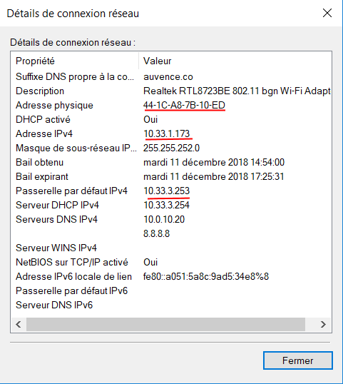

Nom, adresse MAC et adresse IP interface WIFI et Ethernet
====================

Pour afficher ces informations, il faut taper dans la ligne de commandes "ipconfig /all", cela affichera plusieurs informations dont les informations relatives à l'interface WIFI et Ethernet : 

**Carte réseau sans fil Wi-Fi** :

   Suffixe DNS propre à la connexion : auvence.co

   Description : Realtek RTL8723BE 802.11 bgn Wi-Fi Adapter

   **Adresse physique : 44-1C-A8-7B-10-ED**

   DHCP activé : Oui

   Configuration automatique activée : Oui

   Adresse IPv6 de liaison locale : 
   fe80::a051:5a8c:9ad5:34e8%8 (préféré)

   **Adresse IPv4 : 10.33.1.173(préféré)**

   Masque de sous-réseau : 255.255.252.0

   Bail obtenu : mardi 11 décembre 2018 14:54:00

   Bail expirant : mardi 11 décembre 2018 16:25:31

   Passerelle par défaut : 10.33.3.253

   Serveur DHCP : 10.33.3.254

   IAID DHCPv6 : 54795432
   
   DUID de client DHCPv6 : 00-01-00-01-1E-80-9C-1F-70-5A-0F-1E-E0-1E

   Serveurs DNS : 10.0.10.20 
    8.8.8.8

   NetBIOS sur Tcpip : Activé

# Interface Ethernet #
**Carte Ethernet Ethernet** :

   Statut du média : Média déconnecté
   
   Suffixe DNS propre à la connexion : home
   Description : Realtek PCIe FE Family Controller
   
   **Adresse physique : 70-5A-0F-1E-E0-1E**

   DHCP activé : Oui

   Configuration automatique activée : Oui

Et comme nous ne sommes pas connectés par Ethernet, il n'y pas l'adresse ip d'affiché.

Adresse Reseau = 10.33.0.0

Adresse Broadcast = 10.33.1.255

Le Gateaway s'affiche avec la commande " ipconfig /all" sous le nom de "*Passerelle par défaut.*"
----------------

## En graphique (GUI : Graphical User Interface) ##

Suivre le chemin "Panneau de configuration\Réseau et Internet\Connexions réseau" puis faites clique droit sur votre carte wifi puis cliquez sur "Détails", cela affichera les informations de votre carte Wifi via le GUI inclus dans Windows : 

-----

Le Gateaway d'IngéSup permet la liaison entre mon ordinateur et Internet, le gateaway permet donc d'accéder à Internet.

-----

La première ip du réseau est : 10.33.0.1

La dernière ip du réseau est : 10.33.3.255

-----

